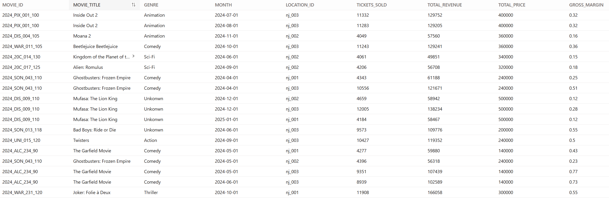
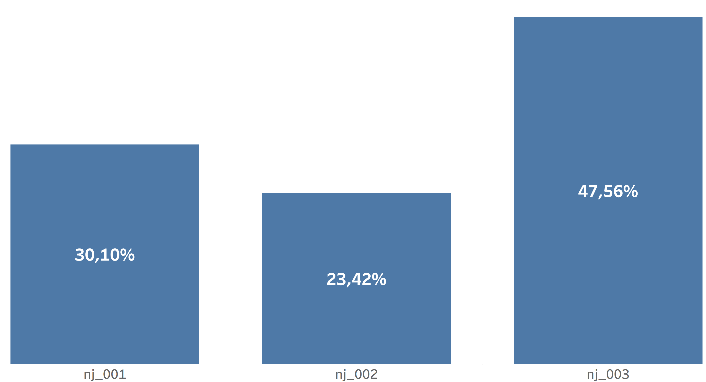

# 🎬 Silverscreen

**Silverscreen** is a data transformation and analytics project built with [dbt](https://www.getdbt.com/), designed to support data-driven decision-making for a newly acquired chain of movie theaters.  
It bridges raw operational data and business insights by transforming and aggregating performance metrics for each theater and movie title.

---

## 🎯 Project Goal

The organisation **Silver Screen** is a small chain of three movie theaters in New Jersey.  
It's Management is seeking to **understand the efficiency and profitability** of these locations — particularly the relationship between **movie rental costs** and **revenue generated**.

The main objective of this project is to build a **monthly performance summary** for each movie across all theater locations. This summary includes:

- 🎞️ Movie details  
- 🏢 Location information  
- 💸 Monthly rental costs per movie  
- 🎟️ Total ticket sales per movie per location  
- 💰 Total revenue generated per movie per location  

This analysis will empower stakeholders to evaluate cost efficiency, optimize pricing strategies, and improve content acquisition decisions.

---

## 🧠 Business Context

The **Silverscreen dbt project** translates raw data into structured analytical models that help visualize performance patterns over time.  
By leveraging modular SQL transformations, the project ensures transparency, reproducibility, and scalability across all analytical workflows.

These transformations ultimately feed into dashboards and reports for management, enabling better forecasting and operational optimization.

---

## 📈 Data Architecture Overview

Below is the DAG (Directed Acyclic Graph) representing the data model dependencies within the dbt project.  
)

## 🧩 Steps to Achieve the Goal

The project was executed in four structured phases within dbt:

1. **Connection & Preparation**  
   Created the database connection and set up the dbt environment.

2. **Sources & Staging Models**  
   Implemented source configurations in YAML files and created staging models to clean and standardize raw data.

3. **Intermediate & Marts Models**  
   Built intermediate and mart models to aggregate, enrich, and structure business-ready data.

4. **Schema, Tests & Jobs**  
   Implemented documentation, tests, and automation jobs to ensure data reliability and scalability.

---

## 🏁 Project Execution & Results

At the end of the analysis, the dbt models produced a **monthly movie performance table** that summarized key metrics across all Silver Screen theaters.  
This table serves as the foundation for BI dashboards and advanced profitability insights.

You can visualize the analytical outcome here:  

